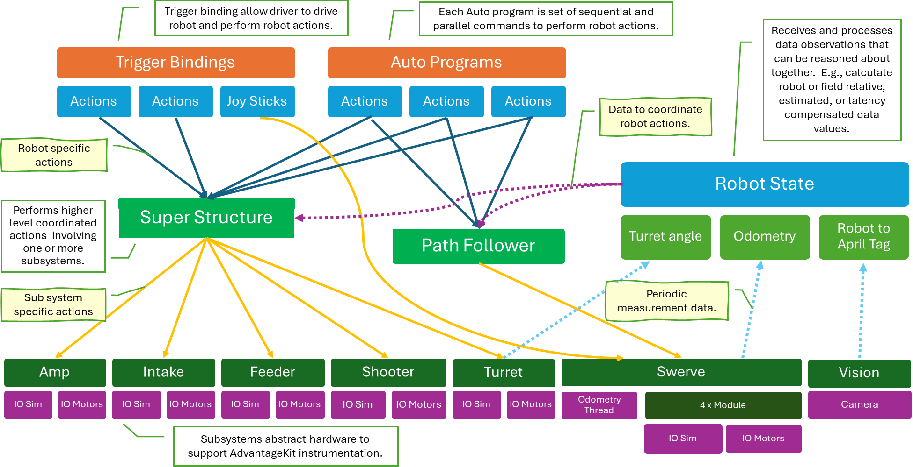

# 2024CompetitionRobot
FRC Team 2910's robot code for the 2024 FRC game CRESCENDO.

### Notable features include:
- Continuous goal tracking
- Absolute turret location calculation on startup
- State machine architecture integrated with WPILIB subsystems
- AdvantageKit logging and IO abstraction layers

### Organization
Here's how we have organized our code logically.

Thanks to FRC Teams 254 and 6328 for the inspiration.

### Packages

[`autos`](src/main/java/frc/robot/autos) - contains autonomous frameworks and programs

[`commands`](src/main/java/frc/robot/commands) - contains classic WPILIB commands

[`config`](src/main/java/frc/robot/config) - contains configuration frameworks with robot data

[`subsystems`](src/main/java/frc/robot/subsystems) - contains robot subsystems and overall robot state machine/superstructure

[`util`](src/main/java/frc/robot/util) - contains utility classes

### General
1. Clone this repo
1. Run `./gradlew` to download gradle and needed FRC/Vendor libraries.  (make sure you're using Java 17 or greater)
1. Run `./gradlew downloadAll` to download FRC tools (ShuffleBoard, etc.)
1. Run `./gradlew tasks` to see available options
1. Have fun!

### Visual Studio Code (Official IDE)
1. Get the WPILib extension for easiest use from the VSCode Marketplace - Requires Java 17 or greater
1. In [`.vscode/settings.json`](.vscode/settings.json), set the User Setting, `java.home`, to the correct directory pointing to your JDK 17 directory

### IntelliJ
1. Run `./gradlew idea`
1. Open the `2024CompetitioRobot.ipr` file with IntelliJ
1. When prompted, select import Gradle build

### Basic Gradle Commands
* Run `./gradlew deploy` to deploy to the robot in Terminal (*nix) or Powershell (Windows)
* Run `./gradlew build` to build the code.  Use the `--info` flag for more details.
* Run `./gradlew assemble` to build the code without running all unit tests.  Use the `--info` flag for more details.
* Run `./gradlew test` to run all the JUnit tests.
